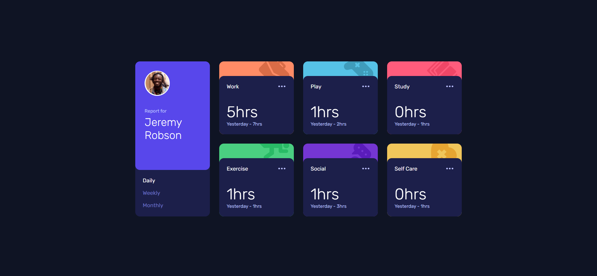
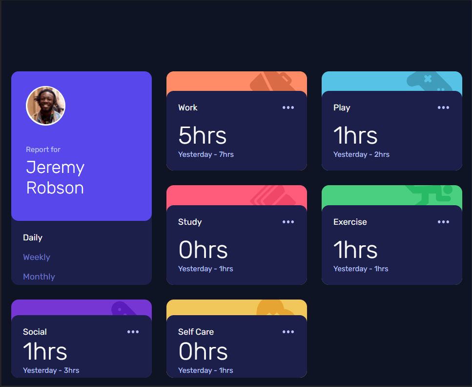
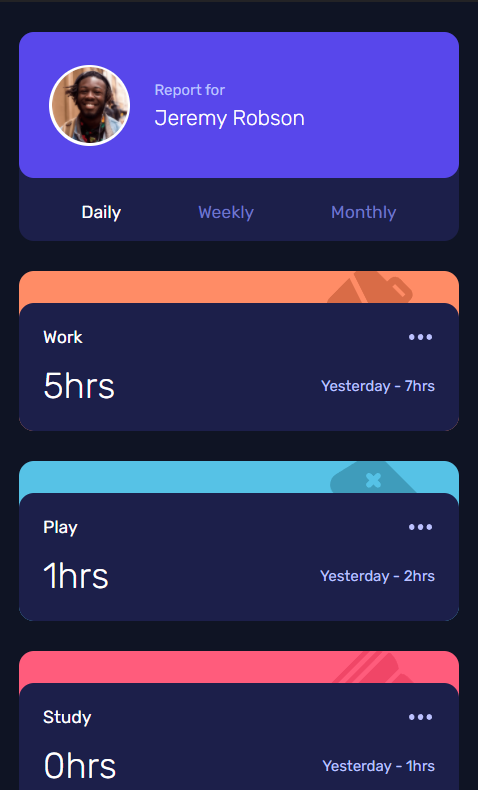

# Frontend Mentor - Time Tracking Dashboard

This is a solution to the [Time Tracking Dashboard challenge on Frontend Mentor](https://www.frontendmentor.io/challenges/time-tracking-dashboard-UIQ7167Jw/hub/time-tracking-dashboard-CAHmOKwjr).

## Table of contents

- [Overview](#overview)
  - [The challenge](#the-challenge)
  - [Screenshots](#screenshots)
  - [Links](#links)
- [My process](#my-process)
  - [Built with](#built-with)
  - [What I learned](#what-i-learned)
  - [Useful resources](#useful-resources)
- [Author](#author)

## Overview

### The challenge

Users should be able to:

- View the optimal layout for the site depending on their device's screen size
- See hover states for all interactive elements on the page
- Switch between viewing Daily, Weekly, and Monthly stats

### Screenshots

#### Desktop 

#### Desktop 770x630

#### Desktop 400x630

### Links

- Live Site URL: [Time Tracking Dashboard](time-tracking-dashboard-brown.vercel.app)

## My process

### Built with

- Semantic HTML5 markup
- CSS custom properties
- Flexbox
- CSS Grid
- JavaScript

### What I learned

I learned in the practice more about:
- How to use grid layout and some of its properties for to do a flexible and responsive site;
- How to manipulate html elements and to listen events from elements with pure js;

### Useful resources

- [MDN Web Docs](https://developer.mozilla.org/pt-BR/docs/Web/CSS/CSS_Grid_Layout/Basic_Concepts_of_Grid_Layout) - This helped me to understand more about the grid layout concepts.

## Author

- LinkedIn - [Mariane Felix](https://www.linkedin.com/in/mariane-felix/)
- Frontend Mentor - [@marianefelix](https://www.frontendmentor.io/profile/marianefelix)